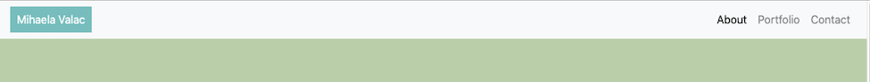
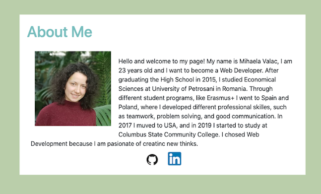
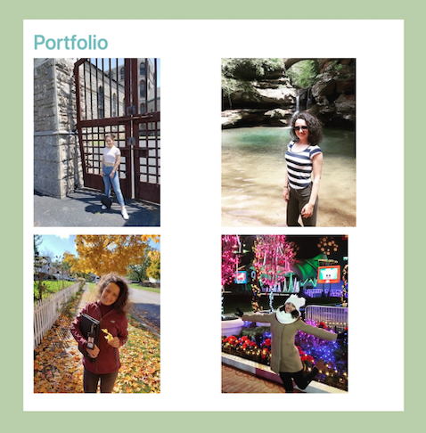
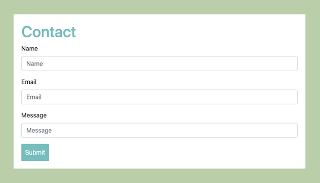

# About my-portfolio project.
This project is the first website created from scratch by applying my knowledges of HTML, CSS, and Bootstrap. I faund Bootstrap very helpful and time saving, and I plan to use it in my further mor complicated and interactive projects. The purpose of the proaject is to create a informative page about me, which contains imformation, pictures, and contact me proffesional social media accounts.   

# Content
The website have a basic structure of header, main, footer, and conect three different html files(index.html, portfolio.htm, contact.html).

In the header is incloded the navigation bar that consist of the title "Mihaela Valac" and three buttons that link the user to the content of their file (About --> index.html || Portfolio --> potfolio.html || Contact --> contact.html) The title of the navigation bar also link the user to the content of index.html.

The main content displays a container which includes different information for each file. 

The index.html includes the "About Me" content which contains a profile picture, a paragraph with information about me, and the icons which are linked to my github and linkendin account. 

The portfolio.html displays 4 pictures to which I added an alt tag for accessibility. 

The contact.html dispays a form which allow the user to contact me by leavin their Name, Email, and the message. 

Also in the main content I crated a fixed footer which contains the copyright content.

# Level of Dificulty
This project required mor time for research (the meaning of different bootstrap clases and elements and how to change them) than for writing the program, therefore I found it not as compicated. It is a very good starting point for the beginners. 

# Deployment link
<a href="https://mihaelavalac.github.io/myportfolio/>Click here to go directly to the project!

